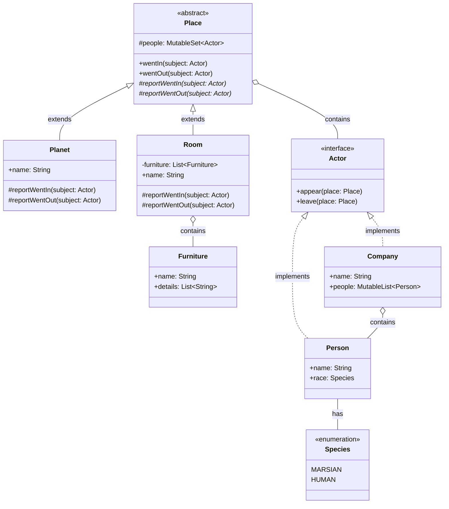

## Вариант


## Часть 1. Модульное тестирование разложения функции в степенной ряд

### Описание реализации

Функция `myArcsin(x)` реализует вычисление арксинуса через разложение в степенной ряд Тейлора. Для значений |x| ≥ 0.999999 используется тригонометрическое тождество для повышения точности вычислений:

```
arcsin(x) = π/2 - arcsin(√(1 - x²)) для x > 0
arcsin(x) = -π/2 + arcsin(√(1 - x²)) для x < 0
```

### Тестовое покрытие

1. **Красивые точки:**
   1. ± 1
   2. ± 0.5 (π/6)
   3. ± 0.707106781 (π/4)
   4. ± 0.866025404 (π/3)
   5. ± 1 (π/2)

2. **Проверка в рамках ОДЗ:**
   - Тесты для значений |x| <= 1

3. **Проверка выхода за область определения:**
   - Тесты для значений |x| > 1, которые должны возвращать NaN


## Часть 2. Модульное тестирование алгоритма красно-черного дерева

### Тестовое покрытие

1. **Базовые операции:**
   - Проверка пустого дерева (`isEmpty()`, `size()`)
   - Вставка элементов (`add()`)
   - Поиск элементов (`contains()`)
   - Преобразование в список (`toList()`)
   - Проверка enum `Color`

2. **Вставка элементов:**
   - Вставка в пустое дерево
   - Вставка в возрастающем порядке
   - Вставка в убывающем порядке
   - Вставка дубликатов (должны игнорироваться)
   - Вставка отрицательных чисел и граничных значений (`Int.MIN_VALUE`, `Int.MAX_VALUE`)

3. **Удаление элементов:**
   - Удаление единственного элемента
   - Удаление несуществующего элемента
   - Удаление узла с одним ребенком
   - Удаление узла с двумя детьми
   - Удаление корня
   - Последовательное удаление всех элементов
   - Смешанные операции вставки и удаления

4. **Ребалансировка:**
   - Косвенная проверка через сценарии вставки/удаления
   - Специальный тест с последовательностью вставок и удалений для проверки корректности структуры дерева

## Часть 3. Доменная модель

>Минуту спустя последняя планета каталога исчезла, и они снова оказались в реальном мире. Они сидели в приемной, уставленной обитой плюшем мебелью, стеклянными столиками и наградами. Перед ними стоял высокий магратеянин.


### Классы доменной модели

1. **Species (Перечисление):**
   - MARSIAN (Марсианин)
   - HUMAN (Человек)

2. **Actor (Интерфейс):**
   - Методы для появления и ухода из места

3. **Person (Класс):**
   - Имя персонажа
   - Раса (Species)
   - Реализует интерфейс Actor

4. **Company (Класс):**
   - Название компании
   - Список людей
   - Реализует интерфейс Actor

5. **Place (Абстрактный класс):**
   - Абстрактные методы для отчета о входе/выходе
   - Множество находящихся внутри акторов

6. **Planet (Класс):**
   - Наследуется от Place
   - Представляет планету

7. **Room (Класс):**
   - Наследуется от Place
   - Представляет комнату с мебелью

8. **Furniture (Класс):**
   - Название мебели
   - Детали мебели

### Диаграмма классов



### Тестовое покрытие

1. **Тесты для Person и Company:**
   - Проверка метода toString()
   
2. **Тесты для Place:**
   - Проверка добавления новых акторов
   - Проверка добавления уже существующих акторов (должна быть ошибка)
   - Проверка выхода существующих акторов
   - Проверка выхода несуществующих акторов (должна быть ошибка)
   - Тестирование методов интерфейса Actor

## Вывод

В рамках выполнения лабораторной работы я закрепил навыки разработки тестов на Kotlin c использованием JUnit5 и дополнительных библиотек.
