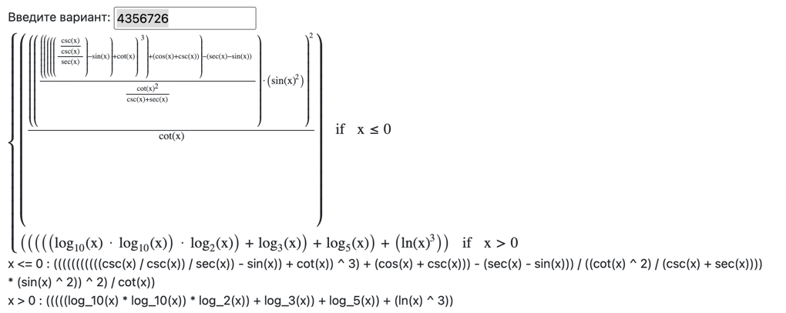

# Отчет по лабораторной работе №2

> Вариант: 4356726



## Разбиение по модулям

### Модули для вычисления при отрицательном аргументе

#### Модуль 1
> Формула: ((((csc(x) / csc(x)) / sec(x)) - sin(x)) + cot(x)) ^ 3

Вольфрам альфа
```
https://www.wolframalpha.com/input?i=f(x)+%3D+((((csc(x)+/+csc(x))+/+sec(x))+-+sin(x))+++cot(x))+%5E+3
```

#### Модуль 2

> Формула: cos(x) + csc(x)

[WolframAlpha](https://www.wolframalpha.com/input?i=f(x)+%3D+cos(x)+++csc(x))

#### Модуль 3
> Формула: 

[WolframAlpha](https://www.wolframalpha.com/input?i=f(x)+%3D+sec(x)+-+sin(x)+at+x+%3D+5.1)

#### Модуль 4(Числитель)
> Формула: (((((csc(x) / csc(x)) / sec(x)) - sin(x)) + cot(x)) + cos(x) + csc(x)) - (sec(x) - sin(x))

Вольфрам альфа
```
https://www.wolframalpha.com/input?i=f(x)+%3D+(((((csc(x)+/+csc(x))+/+sec(x))+-+sin(x))+++cot(x))+++cos(x)+++csc(x))+-+(sec(x)+-+sin(x))
```

#### Модуль 4(Знаменатель)
> Формула: (cot(x) ^ 2) / (csc(x) + sec(x))

Вольфрам альфа
```
https://www.wolframalpha.com/input?i=f(x)+%3D+(cot(x)+%5E+2)+/+(csc(x)+++sec(x))+at+x+%3D+0.1
```


#### Модуль 5
> Формула: ((((((csc(x) / csc(x)) / sec(x)) - sin(x)) + cot(x)) + cos(x) + csc(x)) - (sec(x) - sin(x))) / ((cot(x) ^ 2) / (csc(x) + sec(x)))

Вольфрам альфа

```
https://www.wolframalpha.com/input?i=((((((csc(x)+/+csc(x))+/+sec(x))+-+sin(x))+++cot(x))+++cos(x)+++csc(x))+-+(sec(x)+-+sin(x)))+/+((cot(x)+%5E+2)+/+(csc(x)+++sec(x)))
```

### Модуль 6 (Числитель)
> Формула: ((((((((((csc(x) / csc(x)) / sec(x)) - sin(x)) + cot(x)) ^ 3) + (cos(x) + csc(x))) - (sec(x) - sin(x))) / ((cot(x) ^ 2) / (csc(x) + sec(x)))) * (sin(x) ^ 2)) ^ 2)

Вольфрам альфа

```
https://www.wolframalpha.com/input?i=f(x)%3D((((((((((csc(x)+/+csc(x))+/+sec(x))+-+sin(x))+++cot(x))+%5E+3)+++(cos(x)+++csc(x)))+-+(sec(x)+-+sin(x)))+/+((cot(x)+%5E+2)+/+(csc(x)+++sec(x))))+*+(sin(x)+%5E+2))+%5E+2)
```

### Модули для вычисления при положительном аргументе

#### Модуль 1
> Формула: log₁₀(x) × log₁₀(x) = (log₁₀(x))²

[WolframAlpha](https://www.wolframalpha.com/input?i2d=true&i=Power%5BLog%5B10,x%5D,2%5D)

#### Модуль 2
> Формула: log₁₀(x))² × log₂(x)

[WolframAlpha](https://www.wolframalpha.com/input?i2d=true&i=Power%5BLog%5B10,x%5D,2%5D+*+Log%5B2,x%5D)

#### Модуль 3
> Формула: (log₁₀(x))² × log₂(x) + log₃(x)

[WolframAlpha](https://www.wolframalpha.com/input?i2d=true&i=Power%5BLog%5B10,x%5D,2%5D+*+Log%5B2,x%5D+++Log%5B3,x%5D)

#### Модуль 4
> Формула: (log₁₀(x))² × log₂(x) + log₃(x) + log₅(x)

[WolframAlpha](https://www.wolframalpha.com/input?i2d=true&i=Power%5BLog%5B10,x%5D,2%5D+*+Log%5B2,x%5D+++Log%5B3,x%5D+++Log%5B5,x%5D)

#### Модуль 5
> Формула: ln(x)³ = (ln(x))³

[WolframAlpha](https://www.wolframalpha.com/input?i=ln(x)%5E3)

## Тестирование

### Юнит тесты
Были составлены юнит тесты для каждой базовой функции. Тесты обеспечивают базовую проверку работоспособности

### Интеграционное тестирование
Для каждого из модулей были составлены тесты, в рамках которых выполняется проверка вычислений именно этого конкретного модуля.
Все остальные "зависимости"(модули/функции) были заменены заглушками на основе MockK

Таким образом получилось изолированно протестировать каждый отдельный модуль.