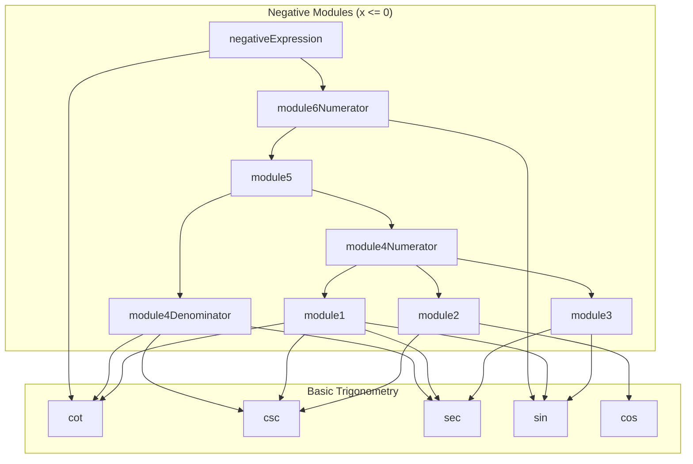
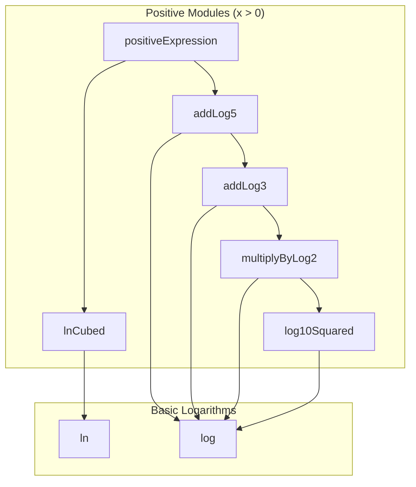
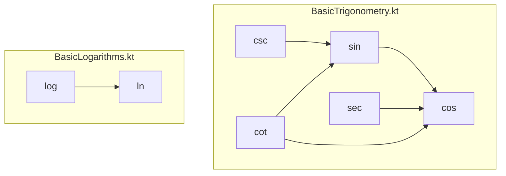
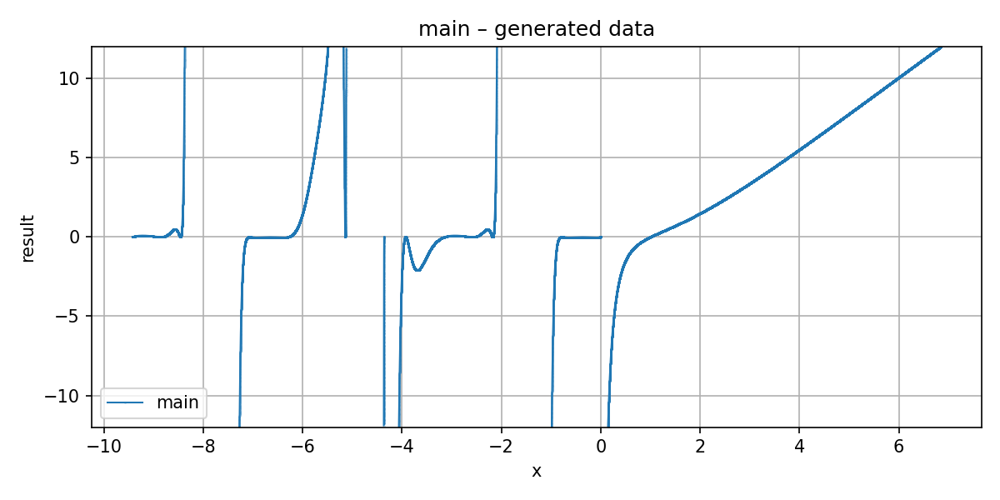
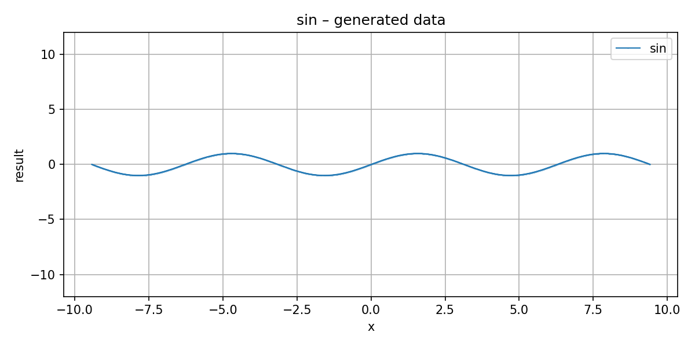
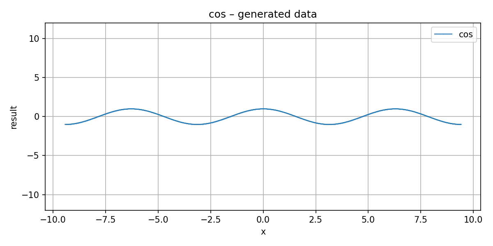
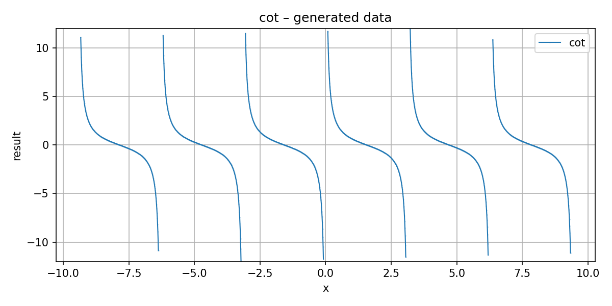
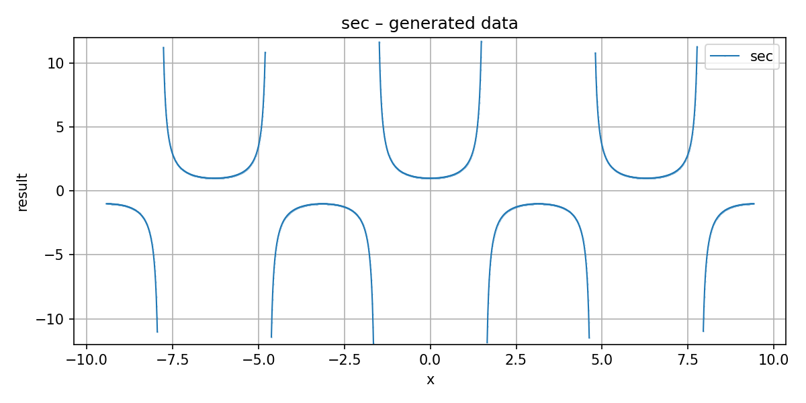
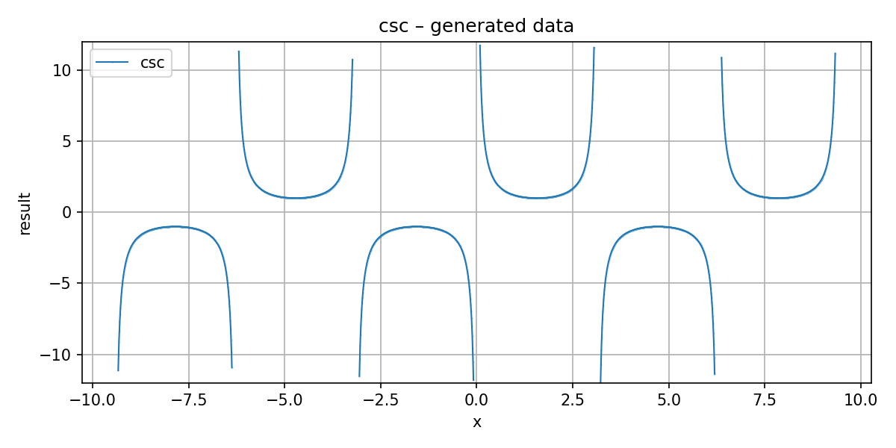

## Вариант
> Вариант: 4356726


Код доступен по [ссылке](https://github.com/GrozniyMax/tpo.git) в ветке lab2

### Цель
Реализовать и провести интеграционное тестирование функции вычисления выражения с заранее заданой стратегией интеграции.

## Архитектура

## Диаграммы зависимости модулей

### Диаграмма зависимостей модулей (Negative Expression)



### Диаграмма зависимостей модулей (Positive Expression)



### Диаграмма зависимостей базовых функций



### Детальное описание зависимостей базовых функций

#### BasicTrigonometry.kt

| Функция  | Зависимости  | Описание                                |
|----------|--------------|-----------------------------------------|
| `cos(x)` | -            | Базовая функция, использует ряд Тейлора |
| `sin(x)` | `cos`        | Вычисляется через cos(π/2 - x)          |
| `sec(x)` | `cos`        | sec(x) = 1 / cos(x)                     |
| `csc(x)` | `sin`        | csc(x) = 1 / sin(x)                     |
| `cot(x)` | `cos`, `sin` | cot(x) = cos(x) / sin(x)                |

#### BasicLogarithms.kt

| Функция        | Зависимости | Описание                                        |
|----------------|-------------|-------------------------------------------------|
| `ln(x)`        | -           | Базовая функция, использует ряд t = (x-1)/(x+1) |
| `log(x, base)` | `ln`        | log_base(x) = ln(x) / ln(base)                  |

## Разбиение по модулям

### Модули для вычисления при отрицательном аргументе

#### Модуль 1

> Формула: ((((csc(x) / csc(x)) / sec(x)) - sin(x)) + cot(x)) ^ 3

Вольфрам альфа

```
https://www.wolframalpha.com/input?i=f(x)+%3D+((((csc(x)+/+csc(x))+/+sec(x))+-+sin(x))+++cot(x))+%5E+3
```

#### Модуль 2

> Формула: cos(x) + csc(x)

[WolframAlpha](https://www.wolframalpha.com/input?i=f(x)+%3D+cos(x)+++csc(x))

#### Модуль 3

> Формула:

[WolframAlpha](https://www.wolframalpha.com/input?i=f(x)+%3D+sec(x)+-+sin(x)+at+x+%3D+5.1)

#### Модуль 4(Числитель)

> Формула: (((((csc(x) / csc(x)) / sec(x)) - sin(x)) + cot(x)) + cos(x) + csc(x)) - (sec(x) - sin(x))

Вольфрам альфа

```
https://www.wolframalpha.com/input?i=f(x)+%3D+(((((csc(x)+/+csc(x))+/+sec(x))+-+sin(x))+++cot(x))+++cos(x)+++csc(x))+-+(sec(x)+-+sin(x))
```

#### Модуль 4(Знаменатель)

> Формула: (cot(x) ^ 2) / (csc(x) + sec(x))

Вольфрам альфа

```
https://www.wolframalpha.com/input?i=f(x)+%3D+(cot(x)+%5E+2)+/+(csc(x)+++sec(x))+at+x+%3D+0.1
```

#### Модуль 5

> Формула: ((((((csc(x) / csc(x)) / sec(x)) - sin(x)) + cot(x)) + cos(x) + csc(x)) - (sec(x) - sin(x))) / ((cot(x) ^

2) / (csc(x) + sec(x)))

Вольфрам альфа

```
https://www.wolframalpha.com/input?i=((((((csc(x)+/+csc(x))+/+sec(x))+-+sin(x))+++cot(x))+++cos(x)+++csc(x))+-+(sec(x)+-+sin(x)))+/+((cot(x)+%5E+2)+/+(csc(x)+++sec(x)))
```

### Модуль 6 (Числитель)

> Формула: ((((((((((csc(x) / csc(x)) / sec(x)) - sin(x)) + cot(x)) ^ 3) + (cos(x) + csc(x))) - (sec(x) - sin(x))) / ((
> cot(x) ^ 2) / (csc(x) + sec(x)))) * (sin(x) ^ 2)) ^ 2)

Вольфрам альфа

```
https://www.wolframalpha.com/input?i=f(x)%3D((((((((((csc(x)+/+csc(x))+/+sec(x))+-+sin(x))+++cot(x))+%5E+3)+++(cos(x)+++csc(x)))+-+(sec(x)+-+sin(x)))+/+((cot(x)+%5E+2)+/+(csc(x)+++sec(x))))+*+(sin(x)+%5E+2))+%5E+2)
```

### Модули для вычисления при положительном аргументе

#### Модуль 1

> Формула: log₁₀(x) × log₁₀(x) = (log₁₀(x))²

[WolframAlpha](https://www.wolframalpha.com/input?i2d=true&i=Power%5BLog%5B10,x%5D,2%5D)

#### Модуль 2

> Формула: log₁₀(x))² × log₂(x)

[WolframAlpha](https://www.wolframalpha.com/input?i2d=true&i=Power%5BLog%5B10,x%5D,2%5D+*+Log%5B2,x%5D)

#### Модуль 3

> Формула: (log₁₀(x))² × log₂(x) + log₃(x)

[WolframAlpha](https://www.wolframalpha.com/input?i2d=true&i=Power%5BLog%5B10,x%5D,2%5D+*+Log%5B2,x%5D+++Log%5B3,x%5D)

#### Модуль 4

> Формула: (log₁₀(x))² × log₂(x) + log₃(x) + log₅(x)

[WolframAlpha](https://www.wolframalpha.com/input?i2d=true&i=Power%5BLog%5B10,x%5D,2%5D+*+Log%5B2,x%5D+++Log%5B3,x%5D+++Log%5B5,x%5D)

#### Модуль 5

> Формула: ln(x)³ = (ln(x))³

[WolframAlpha](https://www.wolframalpha.com/input?i=ln(x)%5E3)

## Графики функций

### График основной функции



### Графики тригонометрических функций

#### Синус (sin)



#### Косинус (cos)



#### Котангенс (cot)



#### Секанс (sec)



#### Косеканс (csc)



## Тестирование

### Юнит тесты

1. Базовое тестирование функцию на ожидаемый результат (package `basic`)
2. Отладочные тесты без мокирования для ветки с отрицательным аргументом (package `notMocked`)

### Интеграционное тестирование
> Для замены компонентов использовался MockK

1. Тестирование модулей в изоляции. Для каждого модуля мокируются все функции от которых он зависит. Это позволяет
   проверить каждый модуль в изоляции.
2. Тестирование вычислений с мокированием базовых функций для негативной ветки
    1. Мокирование csc и cot
    2. Мокирование sin и sec
    3. Мокирование cos
    4. Без моков
3. Тестирование вычислений с мокированием базовых функций для положительной функции ветки
    1. Мокирование logₐ
    2. Мокирование ln
    3. Без моков

## Выводы

В рамках выполнения лабораторной работы была реализована система математических функций для вычисления выражения по варианту. Также было проведено модульное и интеграционное тестирование с использованием JUnit5 и MockK. Это позволило мне закрепить свои навыки использования этих инструментов и углубить их понимание.