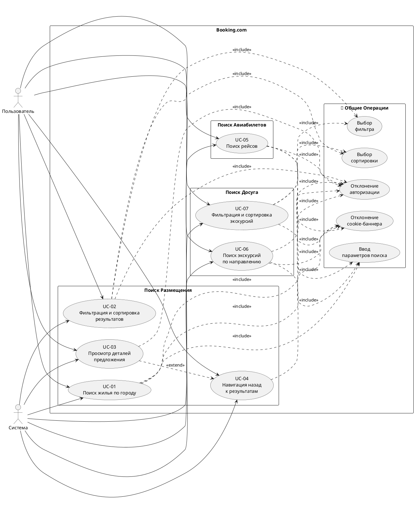
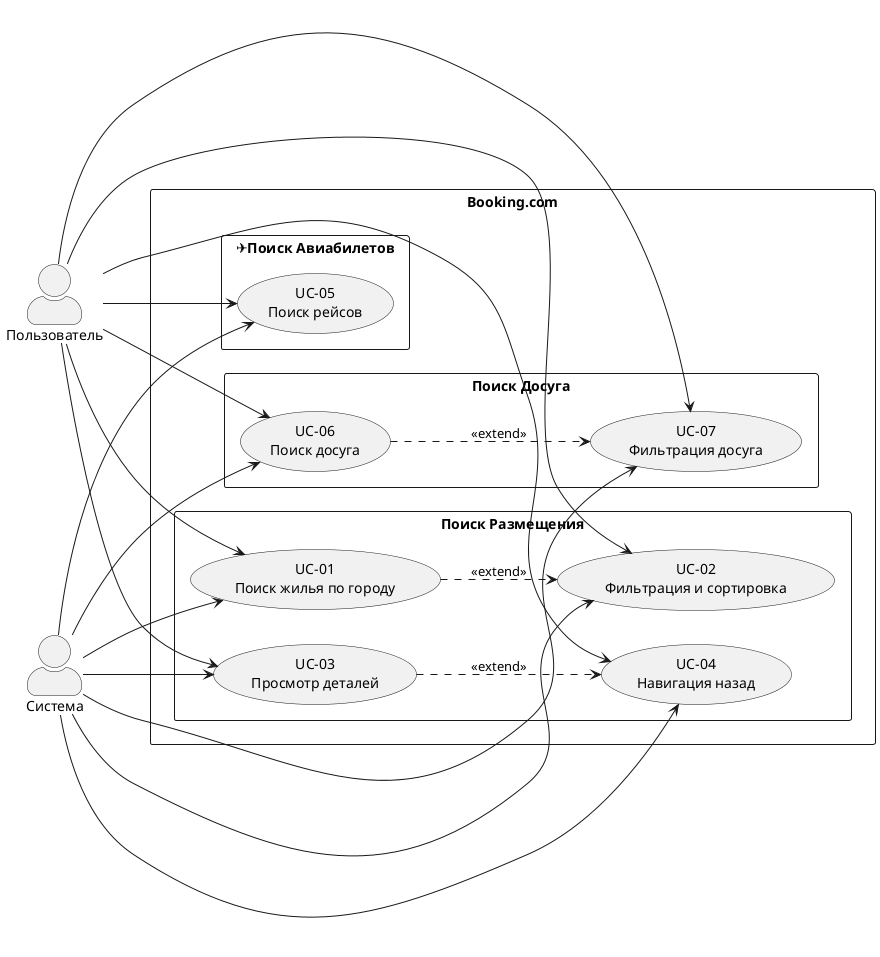

# Use-Case Диаграмма

## Диаграмма Прецедентов Использования

```plantuml
@startuml Booking.com Use-Case Diagram
left to right direction
skinparam packageStyle rectangle

actor "Пользователь" as User
actor "Система" as System

rectangle "Booking.com" {
  
  ' ===== Поиск Размещения =====
  package "Поиск Размещения" {
    usecase "UC-01\nПоиск жилья по городу" as UC01
    usecase "UC-02\nФильтрация и сортировка\nрезультатов" as UC02
    usecase "UC-03\nПросмотр деталей\nпредложения" as UC03
    usecase "UC-04\nНавигация назад\nк результатам" as UC04
  }

  ' ===== Поиск Авиабилетов =====
  package "Поиск Авиабилетов" {
    usecase "UC-05\nПоиск рейсов" as UC05
  }

  ' ===== Поиск Досуга =====
  package "Поиск Досуга" {
    usecase "UC-06\nПоиск экскурсий\nпо направлению" as UC06
    usecase "UC-07\nФильтрация и сортировка\nэкскурсий" as UC07
  }

  ' ===== Общие Операции =====
  package "🔧 Общие Операции" {
    usecase "Отклонение\nавторизации" as Auth
    usecase "Отклонение\ncookie-баннера" as Cookie
    usecase "Ввод\nпараметров поиска" as Input
    usecase "Выбор\nфильтра" as Filter
    usecase "Выбор\nсортировки" as Sort
  }
}

' ===== Связи с актёрами =====
User --> UC01
User --> UC02
User --> UC03
User --> UC04
User --> UC05
User --> UC06
User --> UC07

System --> UC01
System --> UC02
System --> UC03
System --> UC04
System --> UC05
System --> UC06
System --> UC07

' ===== Связи для Поиска Размещения =====
UC01 ..> Auth : <<include>>
UC01 ..> Input : <<include>>
UC01 ..> Cookie : <<include>>

UC02 ..> Auth : <<include>>
UC02 ..> Filter : <<include>>
UC02 ..> Sort : <<include>>

UC03 ..> Auth : <<include>>
UC03 ..> UC04 : <<extend>>

UC04 ..> Auth : <<include>>

' ===== Связи для Поиска Авиабилетов =====
UC05 ..> Auth : <<include>>
UC05 ..> Input : <<include>>
UC05 ..> Cookie : <<include>>

' ===== Связи для Поиска Экскурсий =====
UC06 ..> Auth : <<include>>
UC06 ..> Input : <<include>>
UC06 ..> Cookie : <<include>>

UC07 ..> Cookie : <<include>>
UC07 ..> Filter : <<include>>
UC07 ..> Sort : <<include>>


@enduml
```

---

## Альтернативная Диаграмма (Без Общие Операции)

```plantuml
@startuml Booking.com Use-Case Diagram Simple
left to right direction
skinparam packageStyle rectangle
skinparam actorStyle awesome

actor "Пользователь" as User
actor "Система" as System

rectangle "Booking.com" {
  
  package "Поиск Размещения" {
    usecase "UC-01\nПоиск жилья по городу" as UC01
    usecase "UC-02\nФильтрация и сортировка" as UC02
    usecase "UC-03\nПросмотр деталей" as UC03
    usecase "UC-04\nНавигация назад" as UC04
  }

  package "✈Поиск Авиабилетов" {
    usecase "UC-05\nПоиск рейсов" as UC05
  }

  package "Поиск Досуга" {
    usecase "UC-06\nПоиск досуга" as UC06
    usecase "UC-07\nФильтрация досуга" as UC07
  }
}

' ===== Связи с актёрами =====
User --> UC01
User --> UC02
User --> UC03
User --> UC04
User --> UC05
User --> UC06
User --> UC07

System --> UC01
System --> UC02
System --> UC03
System --> UC04
System --> UC05
System --> UC06
System --> UC07

' ===== Взаимосвязи между прецедентами =====
UC01 ..> UC02 : <<extend>>
UC03 ..> UC04 : <<extend>>
UC06 ..> UC07 : <<extend>>

@enduml
```