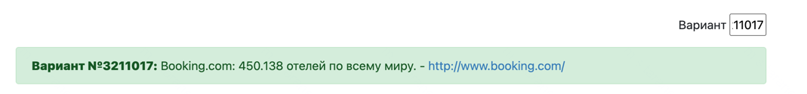
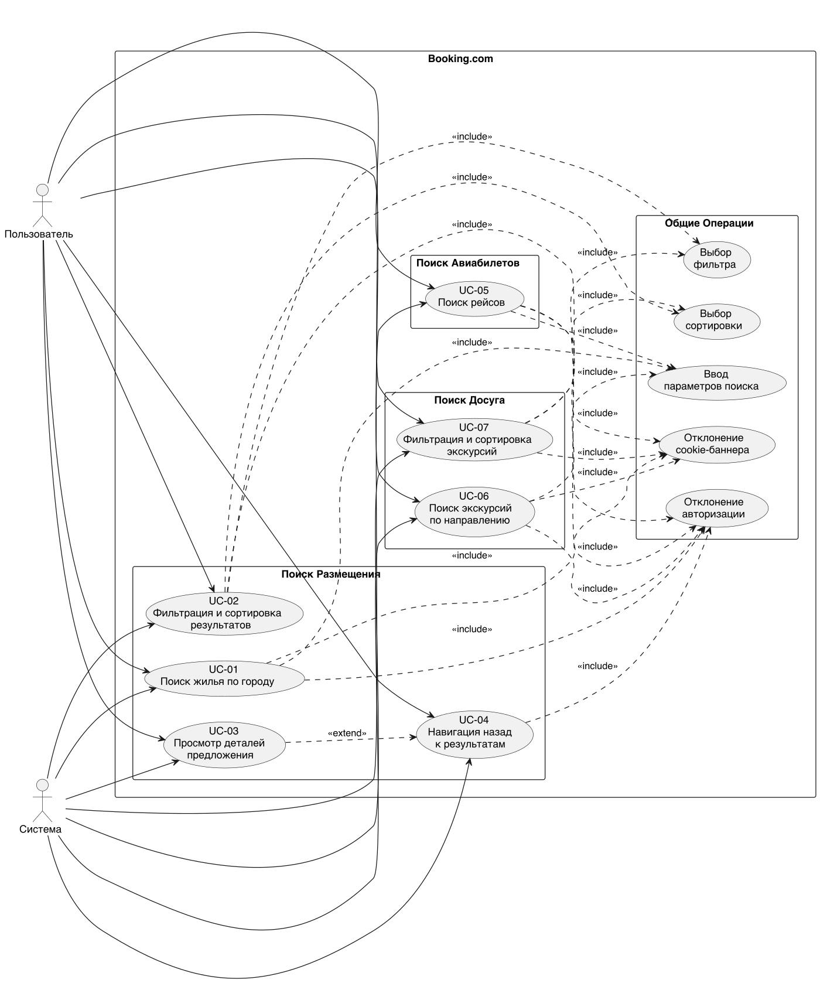
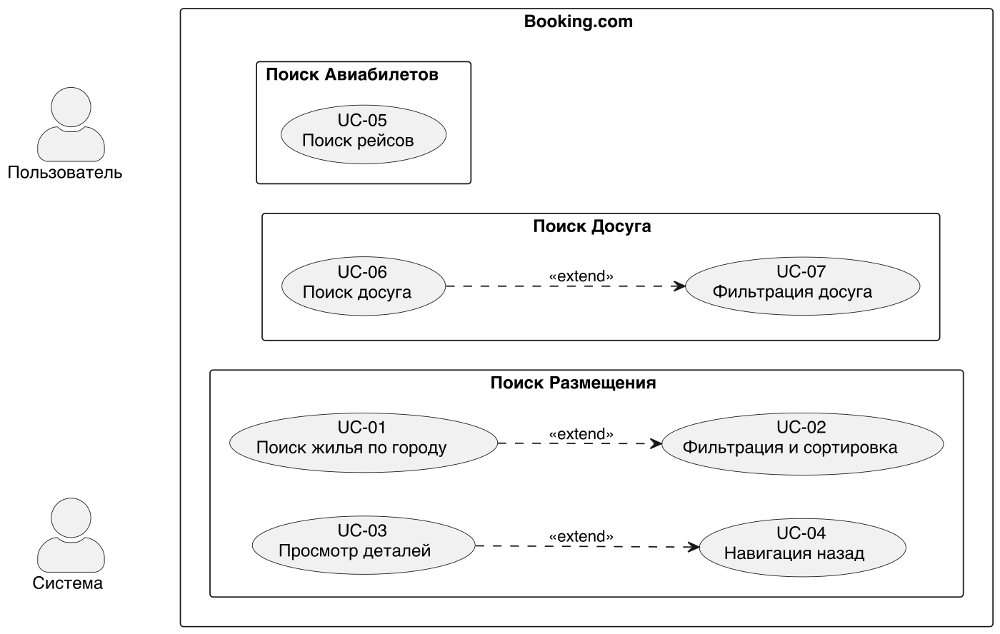

# Отчет по лабораторной работе №3

# по курсу "Тестирование программного обеспечения"

## Задание

В рамках лабораторной работы необходимо провести функциональное тестирование сайта по варианту.
Для тестирования необходимо использовать Selenium WebDriver.

### Вариант задания



## Ссылка на репозиторий

[**Github репозиторий**](https://github.com/GrozniyMax/tpo.git)

## Описание тестируемого объекта

**Booking.com** — международный сайт для поиска и бронирования жилья, авиабилетов, экскурсий и других туристических
услуг.

## Архитектура тестов

Для реализации тестов по заданию необходимо использовать шаблон Page Object.

### Базовый класс тестов

Все тесты наследуются от `SeleniumBaseTest`, который обеспечивает:

- **Инициализацию WebDriver** для выбранного браузера
- **Настройку таймаутов** (implicit wait, page load timeout)
- **Автоматическую очистку** ресурсов после каждого теста

```kotlin
abstract class SeleniumBaseTest(
    private val useHeadless: Boolean = false,
    private val mode: Mode = Mode.CHROME
)
```

### Кросс-браузерное тестирование

Реализована поддержка двух браузеров через enum `Mode`:

- `Mode.CHROME` — тестирование в Google Chrome
- `Mode.FIREFOX` — тестирование в Mozilla Firefox

Для каждого браузера настроены:

- Одинаковый размер окна (1920x1080)
- Единый user-agent для консистентности результатов
- Специфичные настройки для обхода детекции

---

## Тестовые случаи

### Поиск жилья

#### Тестовый случай 1: Поиск жилья по городу

**Предусловия:**

- Пользователь не авторизован
- Пользователь не отклонил cookies
- Пользователь не отклонил регистрацию

| №  | Действующее лицо | **Шаг**                                                 | **Ожидаемый результат**                                      |
|----|------------------|---------------------------------------------------------|--------------------------------------------------------------|
| 1  | Пользователь     | Отклонил cookies                                        | Пользователь не видит окна с предложением принять cookies    |
| 2  | Пользователь     | Отклонил регистрацию                                    | Пользователь не видит окна с предложением зарегистрироваться |
| 3  | Пользователь     | Ввел в поле поиска город (Таллин)                       | Ввод сохранился в поле                                       |
| 4  | Система          | Отобразила подсказки для города                         | Пользователь видит подсказки                                 |
| 5  | Пользователь     | Выбрал первую подсказку                                 | -                                                            |
| 6  | Пользователь     | Нажал на поле выбора дат                                | -                                                            |
| 7  | Система          | Отобразила календарь                                    | Пользователь видит календарь                                 |
| 8  | Пользователь     | Выбрал даты поездки                                     | Результаты ввода сохранились в поле ввода                    |
| 9  | Пользователь     | Нажимает на кнопку выбора                               | Открылась дополнительная менюшка для выбора кол-ва гостей    |
| 10 | Пользователь     | Выбирает кол-во гостей (2 взрослых)                     | Результаты ввода сохранились в поле ввода                    |
| 11 | Пользователь     | Нажимает кнопку поиска                                  | Переход на страницу с предлагаемыми вариантами               |
| 12 | Система          | Отображает подходящие под условия пользователя варианты | Все варианты находятся в городе поиска (Таллин)              |

#### Тестовый случай 2: Поиск жилья без указания города

**Предусловия:**

- Пользователь не авторизован
- Пользователь не отклонил cookies
- Пользователь не отклонил регистрацию

| № | Действующее лицо | **Шаг**                                           | **Ожидаемый результат**                                      |
|---|------------------|---------------------------------------------------|--------------------------------------------------------------|
| 1 | Пользователь     | Отклонил cookies                                  | Пользователь не видит окна с предложением принять cookies    |
| 2 | Пользователь     | Отклонил регистрации                              | Пользователь не видит окна с предложением зарегистрироваться |
| 3 | Пользователь     | Нажал кнопку поиска                               | -                                                            |
| 4 | Система          | Отобразила алерт о невозможности выполнить запрос | Пользователю доступно сообщение                              |

#### Тестовый случай 3: Фильтрация с использованием "популярного фильтра"

**Предусловия:**

- Пользователь не авторизован
- Пользователь не отклонил cookies
- Пользователь не отклонил регистрацию
- Пользователь ввел необходимые параметры поиска (Таллин, 2 взрослых)

| № | Действующее лицо | **Шаг**                                                      | **Ожидаемый результат**                                      |
|---|------------------|--------------------------------------------------------------|--------------------------------------------------------------|
| 1 | Пользователь     | Отклонил cookies                                             | Пользователь не видит окна с предложением принять cookies    |
| 2 | Пользователь     | Отклонил регистрацию                                         | Пользователь не видит окна с предложением зарегистрироваться |
| 3 | Пользователь     | Нажал на фильтр из категории "популярное": "Завтрак включен" | Фильтр отобразился как активный                              |
| 4 | Система          | Отфильтровала варианты                                       | В карточке каждого предложения указано, что завтрак включен  |

#### Тестовый случай 4: Фильтрация с использованием фильтрации по рейтингу

**Предусловия:**

- Пользователь не авторизован
- Пользователь не отклонил cookies
- Пользователь ввел необходимые параметры поиска (Таллин, 2 взрослых)

| № | Действующее лицо | **Шаг**                                        | **Ожидаемый результат**                                      |
|---|------------------|------------------------------------------------|--------------------------------------------------------------|
| 1 | Пользователь     | Отклонил cookies                               | Пользователь не видит окна с предложением принять cookies    |
| 2 | Пользователь     | Отклонил регистрацию                           | Пользователь не видит окна с предложением зарегистрироваться |
| 3 | Пользователь     | Нажал на фильтр по рейтингу: "Превосходно: 9+" | Фильтр отобразился как активный                              |
| 4 | Система          | Отфильтровала варианты                         | Рейтинг каждой карточки больше или равен 9.0                 |

#### Тестовый случай 5: Переход на страницу с подробной информацией о предложении

**Предусловия:**

- Пользователь не авторизован
- Пользователь не отклонил cookies
- Пользователь не отклонил регистрацию
- Пользователь ввел необходимые параметры поиска (Таллин, 2 взрослых)

| № | Действующее лицо | **Шаг**                                                | **Ожидаемый результат**                                      |
|---|------------------|--------------------------------------------------------|--------------------------------------------------------------|
| 1 | Пользователь     | Отклонил cookies                                       | Пользователь не видит окна с предложением принять cookies    |
| 2 | Пользователь     | Отклонил регистрацию                                   | Пользователь не видит окна с предложением зарегистрироваться |
| 3 | Пользователь     | Выбрал понравившийся вариант                           | -                                                            |
| 4 | Пользователь     | Нажал на заголовок карточки                            | Переход на страницу с подробной информацией о предложении    |
| 5 | Система          | Открыла детальное описание предложения в новой вкладке | Название предложения совпадает с названием на карточке       |

#### Тестовый случай 6: Возврат обратно

**Предусловия:**

- Пользователь не авторизован
- Пользователь не отклонил cookies
- Пользователь не отклонил регистрацию
- Пользователь ввел необходимые параметры поиска (Таллин, 2 взрослых)

| № | Действующее лицо | **Шаг**                                                | **Ожидаемый результат**                                      |
|---|------------------|--------------------------------------------------------|--------------------------------------------------------------|
| 1 | Пользователь     | Отклонил cookies                                       | Пользователь не видит окна с предложением принять cookies    |
| 2 | Пользователь     | Отклонил регистрации                                   | Пользователь не видит окна с предложением зарегистрироваться |
| 3 | Пользователь     | Выбрал понравившийся вариант                           | -                                                            |
| 4 | Пользователь     | Нажал на заголовок карточки                            | Переход на страницу с подробной информацией о предложении    |
| 5 | Система          | Открыла детальное описание предложения в новой вкладке | Название предложения совпадает с названием на карточке       |
| 6 | Пользователь     | Вернулся на страницу поиска                            | Предложения отображаются в том же виде и порядке             |

#### Тестовый случай 7: Проверка работы фильтрации по "спрятанным атрибутам"

> "Спрятанный атрибут" — атрибуты, которые не отображаются на карточке, и чтобы проверить их наличие необходимо перейти
> на детальное описание

**Предусловия:**

- Пользователь не авторизован
- Пользователь не отклонил cookies
- Пользователь не отклонил регистрацию
- Пользователь ввел необходимые параметры поиска (Таллин, 2 взрослых)

| № | Действующее лицо | **Шаг**                                                | **Ожидаемый результат**                                      |
|---|------------------|--------------------------------------------------------|--------------------------------------------------------------|
| 1 | Пользователь     | Отклонил cookies                                       | Пользователь не видит окна с предложением принять cookies    |
| 2 | Пользователь     | Отклонил регистрации                                   | Пользователь не видит окна с предложением зарегистрироваться |
| 3 | Пользователь     | Выбрал фильтр "с парковкой"                            | Пользователю отображаются только предложения с парковкой     |
| 4 | Пользователь     | Выбрал понравившийся вариант                           | -                                                            |
| 5 | Пользователь     | Нажал на заголовок карточки                            | Переход на страницу с подробной информацией о предложении    |
| 6 | Система          | Открыла детальное описание предложения в новой вкладке | В описании предложения указана доступная парковка            |

---

### Поиск авиабилетов

#### Тестовый случай 8: Поиск рейсов по международному направлению

**Предусловия:**

- Пользователь не авторизован
- Пользователь не отклонил cookies
- Пользователь не отклонил регистрацию

| №  | Действующее лицо | **Шаг**                             | **Ожидаемый результат**                                      |
|----|------------------|-------------------------------------|--------------------------------------------------------------|
| 1  | Пользователь     | Отклонил cookies                    | Пользователь не видит окна с предложением принять cookies    |
| 2  | Пользователь     | Отклонил регистрации                | Пользователь не видит окна с предложением зарегистрироваться |
| 3  | Пользователь     | Нажал на поле "Откуда"              | Поле активно для ввода                                       |
| 4  | Пользователь     | Ввел город отправления (Стокгольм)  | Ввод сохранился в поле                                       |
| 5  | Система          | Отобразила подсказки для города     | Пользователь видит подсказки                                 |
| 6  | Пользователь     | Выбрал первую подсказку             | Город отправления сохранён                                   |
| 7  | Пользователь     | Нажал на поле "Куда"                | Поле активно для ввода                                       |
| 8  | Пользователь     | Ввел город назначения (Стамбул)     | Ввод сохранился в поле                                       |
| 9  | Система          | Отобразила подсказки для города     | Пользователь видит подсказки                                 |
| 10 | Пользователь     | Выбрал первую подсказку             | Город назначения сохранён                                    |
| 11 | Пользователь     | Нажал кнопку "Найти"                | Переход на страницу с результатами поиска                    |
| 12 | Система          | Отображает подходящие рейсы         | Найдены рейсы с 2 сегментами (туда и обратно)                |
| 13 | Система          | Проверка первого сегмента (туда)    | Вылет 9 мая, ARN → SAW/IST, время вылета < времени прилёта   |
| 14 | Система          | Проверка второго сегмента (обратно) | Вылет 16 мая, SAW → ARN, время вылета < времени прилёта      |

#### Тестовый случай 9: Поиск рейсов по РФ (пустой результат)

**Предусловия:**

- Пользователь не авторизован
- Пользователь не отклонил cookies
- Пользователь не отклонил регистрацию

| № | Действующее лицо | **Шаг**                                 | **Ожидаемый результат**                                      |
|---|------------------|-----------------------------------------|--------------------------------------------------------------|
| 1 | Пользователь     | Отклонил cookies                        | Пользователь не видит окна с предложением принять cookies    |
| 2 | Пользователь     | Отклонил регистрации                    | Пользователь не видит окна с предложением зарегистрироваться |
| 3 | Пользователь     | Отклонил автокомплит                    | Автокомплит отклонён                                         |
| 4 | Пользователь     | Ввел город отправления (Москва)         | Город отправления сохранён                                   |
| 5 | Пользователь     | Ввел город назначения (Санкт-Петербург) | Город назначения сохранён                                    |
| 6 | Пользователь     | Нажал кнопку "Найти"                    | Переход на страницу с результатами поиска                    |
| 7 | Система          | Отображает результаты поиска            | Список рейсов пуст (нет доступных рейсов)                    |

#### Тестовый случай 10: Поиск рейсов "туда и обратно"

**Предусловия:**

- Пользователь не авторизован
- Пользователь не отклонил cookies
- Пользователь не отклонил регистрацию
- Пользователь ввел параметры (Стокгольм → Стамбул, 9-16 мая)

| № | Действующее лицо | **Шаг**                             | **Ожидаемый результат**                                      |
|---|------------------|-------------------------------------|--------------------------------------------------------------|
| 1 | Пользователь     | Отклонил cookies                    | Пользователь не видит окна с предложением принять cookies    |
| 2 | Пользователь     | Отклонил регистрации                | Пользователь не видит окна с предложением зарегистрироваться |
| 3 | Система          | Загрузила страницу результатов      | Отображаются карточки рейсов                                 |
| 4 | Система          | Проверка каждого рейса              | Каждый рейс содержит 2 сегмента (туда и обратно)             |
| 5 | Система          | Проверка первого сегмента (туда)    | Вылет 9 мая, ARN → SAW/IST                                   |
| 6 | Система          | Проверка второго сегмента (обратно) | Вылет 16 мая, SAW → ARN                                      |

#### Тестовый случай 11: Поиск рейсов "в одну сторону"

**Предусловия:**

- Пользователь не авторизован
- Пользователь не отклонил cookies
- Пользователь не отклонил регистрацию
- Пользователь ввел параметры (Стокгольм → Стамбул, 9-16 мая)

| № | Действующее лицо | **Шаг**                            | **Ожидаемый результат**                                      |
|---|------------------|------------------------------------|--------------------------------------------------------------|
| 1 | Пользователь     | Отклонил cookies                   | Пользователь не видит окна с предложением принять cookies    |
| 2 | Пользователь     | Отклонил регистрации               | Пользователь не видит окна с предложением зарегистрироваться |
| 3 | Система          | Загрузила страницу результатов     | Отображаются карточки рейсов                                 |
| 4 | Пользователь     | Выбрал тип поиска "В одну сторону" | Тип поиска изменён                                           |
| 5 | Пользователь     | Нажал кнопку поиска                | Обновлены результаты поиска                                  |
| 6 | Система          | Проверка каждого рейса             | Каждый рейс содержит 1 сегмент (только туда)                 |
| 7 | Система          | Проверка сегмента                  | Вылет 9 мая, ARN → SAW/IST                                   |

---

### Экскурсии и достопримечательности

#### Тестовый случай 12: Поиск экскурсий по направлению

**Предусловия:**

- Пользователь не авторизован
- Пользователь не отклонил cookies

| № | Действующее лицо | **Шаг**                          | **Ожидаемый результат**                       |
|---|------------------|----------------------------------|-----------------------------------------------|
| 1 | Пользователь     | Отклонил cookies                 | Пользователь не видит окна с cookies          |
| 2 | Пользователь     | Ввел направление поиска (Таллин) | Направление сохранено в поле                  |
| 3 | Пользователь     | Выбрал дату экскурсии (завтра)   | Дата сохранена в поле                         |
| 4 | Пользователь     | Нажал кнопку поиска              | Переход на страницу с результатами            |
| 5 | Система          | Отображает результаты поиска     | Найдены экскурсии (непустой список)           |
| 6 | Система          | Проверка каждой экскурсии        | У каждой экскурсии есть заголовок (не пустой) |

#### Тестовый случай 13: Фильтрация экскурсий по "Бесплатной отмене"

**Предусловия:**

- Пользователь не авторизован
- Пользователь не отклонил cookies
- Пользователь находится на странице результатов поиска экскурсий

| № | Действующее лицо | **Шаг**                             | **Ожидаемый результат**               |
|---|------------------|-------------------------------------|---------------------------------------|
| 1 | Пользователь     | Отклонил cookies                    | Пользователь не видит окна с cookies  |
| 2 | Пользователь     | Нажал на фильтр "Бесплатная отмена" | Фильтр применён                       |
| 3 | Система          | Обновила результаты поиска          | Отображаются карточки экскурсий       |
| 4 | Система          | Проверка каждой экскурсии           | Все экскурсии имеют бесплатную отмену |

#### Тестовый случай 14: Сортировка экскурсий по цене

**Предусловия:**

- Пользователь не авторизован
- Пользователь не отклонил cookies
- Пользователь находится на странице результатов поиска экскурсий

| № | Действующее лицо | **Шаг**                               | **Ожидаемый результат**              |
|---|------------------|---------------------------------------|--------------------------------------|
| 1 | Пользователь     | Отклонил cookies                      | Пользователь не видит окна с cookies |
| 2 | Пользователь     | Выбрал сортировку "Самая низкая цена" | Сортировка применена                 |
| 3 | Система          | Обновила результаты поиска            | Отображаются карточки экскурсий      |
| 4 | Система          | Проверка порядка цен                  | Цены отсортированы по возрастанию    |

---

## Прецеденты использования (Use Cases)

### UC-01: Поиск жилья по городу

**Идентификатор:** UC-01  
**Наименование:** Поиск жилья по городу  
**Акторы:** Пользователь, Система  
**Триггер:** Пользователь открыл сайт `https://www.booking.com/`  
**Результат:** Просмотр предлагаемых вариантов жилья

**Предусловия:**

- Пользователь не авторизован
- Пользователь находится на стартовой странице `https://www.booking.com/`

**Основной поток событий:**

| Шаг | Действующее лицо | Действие                          | Результат                       |
|-----|------------------|-----------------------------------|---------------------------------|
| 1   | Пользователь     | Отклоняет авторизацию/регистрацию | Окно регистрации закрыто        |
| 2   | Пользователь     | Вводит город в поле поиска        | Текст сохранён в поле           |
| 3   | Система          | Отображает подсказки для города   | Пользователь видит подсказки    |
| 4   | Пользователь     | Выбирает первую подсказку         | Город поиска сохранён           |
| 5   | Пользователь     | Нажимает на поле выбора дат       | Отображается календарь          |
| 6   | Пользователь     | Выбирает даты поездки             | Даты сохранены в поле           |
| 7   | Пользователь     | Нажимает на кнопку выбора гостей  | Открывается меню выбора гостей  |
| 8   | Пользователь     | Выбирает количество гостей        | Количество сохранено в поле     |
| 9   | Пользователь     | Нажимает кнопку поиска            | Переход на страницу результатов |
| 10  | Система          | Отображает подходящие варианты    | Все варианты в городе поиска    |

**Постусловия:** Пользователь находится на странице результатов поиска жилья

---

### UC-02: Фильтрация и сортировка результатов

**Идентификатор:** UC-02  
**Наименование:** Фильтрация и сортировка результатов  
**Акторы:** Пользователь, Система  
**Триггер:** Пользователь нажал кнопку "Найти" на странице поиска  
**Результат:** Фильтрация результатов поиска

**Предусловия:**

- Пользователь не авторизован
- Пользователь находится на странице с карточками предложений

**Основной поток событий:**

| Шаг | Действующее лицо | Действие                           | Результат                |
|-----|------------------|------------------------------------|--------------------------|
| 1   | Пользователь     | Отклоняет регистрацию/авторизацию  | Окно закрыто             |
| 2   | Пользователь     | Выбирает фильтр                    | Фильтр выделен           |
| 3   | Пользователь     | Нажимает на выбранный фильтр       | Фильтр активирован       |
| 4   | Система          | Применяет фильтр к результатам     | Результаты отфильтрованы |
| 5   | Пользователь     | Выбирает сортировку                | Сортировка выделена      |
| 6   | Система          | Применяет сортировку к результатам | Результаты отсортированы |

**Постусловия:** Результаты отфильтрованы и отсортированы по выбранным критериям

---

### UC-03: Просмотр деталей предложения

**Идентификатор:** UC-03  
**Наименование:** Просмотр деталей предложения  
**Акторы:** Пользователь, Система  
**Триггер:** Клик по карточке предложения  
**Результат:** Просмотр детального описания карточки

**Предусловия:**

- Пользователь не авторизован
- Пользователь находится на странице с карточками предложений

**Основной поток событий:**

| Шаг | Действующее лицо | Действие                                     | Результат                      |
|-----|------------------|----------------------------------------------|--------------------------------|
| 1   | Пользователь     | Отклоняет регистрацию/авторизацию            | Окно закрыто                   |
| 2   | Пользователь     | Выбирает понравившийся вариант               | Карточка выделена              |
| 3   | Пользователь     | Нажимает на заголовок карточки               | Переход на страницу деталей    |
| 4   | Система          | Открывает детальное описание в новой вкладке | Название совпадает с карточкой |

**Постусловия:** Пользователь просматривает детальную информацию о предложении

---

### UC-04: Навигация назад к результатам

**Идентификатор:** UC-04  
**Наименование:** Навигация назад к результатам  
**Акторы:** Пользователь, Система  
**Триггер:** Клик кнопки "Назад" в браузере  
**Результат:** Возврат на страницу результатов поиска

**Предусловия:**

- Пользователь не авторизован
- Пользователь находится на странице деталей предложения

**Основной поток событий:**

| Шаг | Действующее лицо | Действие                          | Результат                       |
|-----|------------------|-----------------------------------|---------------------------------|
| 1   | Пользователь     | Отклоняет регистрацию/авторизацию | Окно закрыто                    |
| 2   | Пользователь     | Находится на странице деталей     | Детали отображаются             |
| 3   | Пользователь     | Возвращается на страницу поиска   | Переход на страницу результатов |
| 4   | Система          | Отображает результаты поиска      | Предложения в том же порядке    |

**Постусловия:** Пользователь вернулся на страницу результатов поиска

---

### UC-05: Поиск рейсов

**Идентификатор:** UC-05  
**Наименование:** Поиск рейсов по международному направлению  
**Акторы:** Пользователь, Система  
**Триггер:** Клик по кнопке "Авиабилеты" в навигационной панели  
**Результат:** Просмотр предложений по маршруту

**Предусловия:**

- Пользователь не авторизован
- Пользователь находится на стартовой странице `https://www.booking.com/`

**Основной поток событий:**

| Шаг | Действующее лицо | Действие                                  | Результат                       |
|-----|------------------|-------------------------------------------|---------------------------------|
| 1   | Пользователь     | Отклоняет регистрацию                     | Окно регистрации закрыто        |
| 2   | Пользователь     | Нажимает на поле "Откуда"                 | Поле активно для ввода          |
| 3   | Пользователь     | Вводит город отправления                  | Текст сохранён в поле           |
| 4   | Система          | Отображает подсказки                      | Пользователь видит подсказки    |
| 5   | Пользователь     | Выбирает первую подсказку                 | Город отправления сохранён      |
| 6   | Пользователь     | Нажимает на поле "Куда"                   | Поле активно для ввода          |
| 7   | Пользователь     | Вводит город назначения                   | Текст сохранён в поле           |
| 8   | Система          | Отображает подсказки                      | Пользователь видит подсказки    |
| 9   | Пользователь     | Выбирает первую подсказку                 | Город назначения сохранён       |
| 10  | Пользователь     | Указывает даты маршрута                   | Даты сохранены в поле           |
| 11  | Пользователь     | Нажимает кнопку "Найти"                   | Переход на страницу результатов |
| 12  | Система          | Отображает подходящие рейсы               | Найдены рейсы по маршруту       |
| 13  | Пользователь     | Выбирает режим (в одну/в обе стороны)     | Режим поиска изменён            |
| 14  | Система          | Формирует предложения относительно выбора | Результаты обновлены            |

**Постусловия:** Пользователь видит результаты поиска рейсов, соответствующие выбранным параметрам

---

### UC-06: Поиск экскурсий по направлению

**Идентификатор:** UC-06  
**Наименование:** Поиск экскурсий по направлению  
**Акторы:** Пользователь, Система  
**Триггер:** Клик по кнопке "Варианты досуга" в навигационной панели  
**Результат:** Просмотр предложений по досугу

**Предусловия:**

- Пользователь не авторизован
- Пользователь находится на стартовой странице `https://www.booking.com/`

**Основной поток событий:**

| Шаг | Действующее лицо | Действие                          | Результат                       |
|-----|------------------|-----------------------------------|---------------------------------|
| 1   | Пользователь     | Отклоняет авторизацию/регистрацию | Окно закрыто                    |
| 2   | Пользователь     | Вводит направление поиска         | Текст сохранён в поле           |
| 3   | Пользователь     | Выбирает дату экскурсии           | Дата сохранена в поле           |
| 4   | Пользователь     | Нажимает кнопку поиска            | Переход на страницу результатов |
| 5   | Система          | Отображает результаты поиска      | Найдены экскурсии               |
| 6   | Система          | Проверяет каждую экскурсию        | У каждой есть заголовок         |

**Постусловия:** Пользователь видит доступные экскурсии

---

### UC-07: Фильтрация и сортировка экскурсий

**Идентификатор:** UC-07  
**Наименование:** Фильтрация и сортировка экскурсий  
**Акторы:** Пользователь, Система  
**Триггер:** Активация фильтров или сортировки  
**Результат:** Просмотр отфильтрованных предложений по досугу

**Предусловия:**

- Пользователь не авторизован
- Пользователь находится на странице результатов досуга

**Основной поток событий:**

| Шаг | Действующее лицо | Действие                    | Результат                |
|-----|------------------|-----------------------------|--------------------------|
| 1   | Пользователь     | Отклоняет cookie-баннер     | Баннер закрыт            |
| 2   | Пользователь     | Выбирает фильтр             | Фильтр выделен           |
| 3   | Система          | Обновляет результаты поиска | Результаты отфильтрованы |
| 4   | Пользователь     | Выбирает способ сортировки  | Сортировка выделена      |
| 5   | Система          | Обновляет результаты поиска | Результаты отсортированы |

**Постусловия:** Результаты отфильтрованы и отсортированы по выбранным критериям

---

## Диаграмма прецедентов использования

### Полная диаграмма



### Упрощённая диаграмма



---

## Чек-лист тестового покрытия

### Покрытие функциональных требований

| №  | Требование / Функция              | Статус | Тесты                                                 | Примечание           |
|----|-----------------------------------|--------|-------------------------------------------------------|----------------------|
| 1  | Поиск жилья по городу             |        | SearchTest.testGuestSearchAccommodation               | Основной сценарий    |
| 2  | Поиск жилья без города            |        | SearchTest.testSearchWithoutPlace                     | Обработка ошибок     |
| 3  | Фильтрация по популярным фильтрам |        | SearchResultsTest.filterByPopular                     | "Завтрак включен"    |
| 4  | Фильтрация по рейтингу            |        | SearchResultsTest.filterByRating                      | "Превосходно: 9+"    |
| 5  | Переход на страницу деталей       |        | SearchResultsTest.goToDetailsPage                     | Клик по заголовку    |
| 6  | Навигация назад                   |        | SearchResultsTest.goBackToResults                     | Сохранение состояния |
| 7  | Проверка скрытых атрибутов        |        | DetailsPageTest.checkHiddenAttributes                 | Парковка и др.       |
| 8  | Поиск авиабилетов (международный) |        | SearchTest.testSearchFlights                          | Стокгольм → Стамбул  |
| 9  | Поиск авиабилетов (РФ)            |        | SearchTest.testSearchFlightsRF                        | Пустой результат     |
| 10 | Поиск "туда и обратно"            |        | SearchResultsTest.testRoundTrip                       | 2 сегмента           |
| 11 | Поиск "в одну сторону"            |        | SearchResultsTest.testOneWay                          | 1 сегмент            |
| 12 | Поиск экскурсий по направлению    |        | AttractionsSearchTest.testSearchAttractions           | Таллин               |
| 13 | Фильтрация экскурсий              |        | AttractionsSearchResultsTest.filterByFreeCancellation | Бесплатная отмена    |
| 14 | Сортировка экскурсий              |        | AttractionsSearchResultsTest.sortTest                 | По цене              |

### Покрытие нефункциональных требований

| № | Требование                     | Статус | Метод проверки                    |
|---|--------------------------------|--------|-----------------------------------|
| 1 | Кросс-браузерность             |        | Тесты в Chrome и Firefox          |
| 2 | Обработка cookie-баннеров      |        | BookingCookiePage.rejectCookies() |
| 3 | Обработка диалогов регистрации |        | BookingCookiePage.rejectAuth()    |
| 4 | Таймауты и ожидания            |        | WebDriverWait (30 сек)            |
| 5 | Стабильность тестов            |        | Повторяемые прогоны               |
| 6 | Читаемость кода                |        | Page Object Pattern               |
| 7 | Поддерживаемость               |        | XPath локаторы в PageObject       |

### Покрытие Use Case

| Use Case | Описание                            | Статус | Тесты                                                           |
|----------|-------------------------------------|--------|-----------------------------------------------------------------|
| UC-01    | Поиск жилья по городу               |        | SearchTest.testGuestSearchAccommodation                         |
| UC-02    | Фильтрация и сортировка результатов |        | SearchResultsTest.filterByPopular, filterByRating               |
| UC-03    | Просмотр деталей предложения        |        | SearchResultsTest.goToDetailsPage                               |
| UC-04    | Навигация назад к результатам       |        | SearchResultsTest.goBackToResults                               |
| UC-05    | Поиск рейсов                        |        | SearchTest.testSearchFlights                                    |
| UC-06    | Поиск экскурсий по направлению      |        | AttractionsSearchTest.testSearchAttractions                     |
| UC-07    | Фильтрация и сортировка экскурсий   |        | AttractionsSearchResultsTest.filterByFreeCancellation, sortTest |

### Итоговая статистика покрытия

| Метрика                     | Значение            |
|-----------------------------|---------------------|
| Функциональные требования   | 14/14 (100%)        |
| Нефункциональные требования | 7/7 (100%)          |
| Use Case                    | 7/7 (100%)          |
| Тестовых сценариев          | 14                  |
| Автоматизированных тестов   | 14                  |
| Браузеров                   | 2 (Chrome, Firefox) |

---

## Описание набора тестовых сценариев

## Результаты тестирования

### Сводная таблица результатов

| Категория                     | Тестов | Пройдено | Провалено | Пропущено | % Успеха |
|-------------------------------|--------|----------|-----------|-----------|----------|
| Поиск жилья (Place)           | 7      | 7        | 0         | 0         | 100%     |
| Поиск авиабилетов (Plane)     | 4      | 4        | 0         | 0         | 100%     |
| Поиск экскурсий (Attractions) | 3      | 3        | 0         | 0         | 100%     |
| **Итого**                     | **14** | **14**   | **0**     | **0**     | **100%** |

### Результаты по браузерам

| Браузер | Тестов | Пройдено | Провалено | 
|---------|--------|----------|-----------|
| Chrome  | 14     | 14       | 0         | 
| Firefox | 14     | 13       | 1         | 

> В Firefox не проходит поиск жилья, так как при одинаковых введеных данных он не выдает результаты поиска в отличии от Chrome

### Детализация результатов

#### Поиск жилья (Place)

| № | Тест                         | Статус | Комментарий                  |
|---|------------------------------|--------|------------------------------|
| 1 | testGuestSearchAccommodation | PASS   | Успешный поиск по Таллину    |
| 2 | testSearchWithoutPlace       | PASS   | Alert отображается корректно |
| 3 | filterByPopular              | PASS   | Фильтр применяется           |
| 4 | filterByRating               | PASS   | Все отели ≥ 9.0              |
| 5 | goToDetailsPage              | PASS   | Переход успешен              |
| 6 | goBackToResults              | PASS   | Состояние сохранено          |
| 7 | checkHiddenAttributes        | PASS   | Парковка найдена             |

#### Поиск авиабилетов (Plane)

| № | Тест                | Статус | Комментарий                 |
|---|---------------------|--------|-----------------------------|
| 1 | testSearchFlightsRF | PASS   | Пустой результат (ожидаемо) |
| 2 | testSearchFlights   | PASS   | 2 сегмента, ARN→SAW         |
| 3 | testRoundTrip       | PASS   | 2 сегмента подтверждено     |
| 4 | testOneWay          | PASS   | 1 сегмент подтверждено      |

#### Поиск экскурсий (Attractions)

| № | Тест                     | Статус | Комментарий              |
|---|--------------------------|--------|--------------------------|
| 1 | testSearchAttractions    | PASS   | Найдено экскурсий: 50+   |
| 2 | filterByFreeCancellation | PASS   | Все с бесплатной отменой |
| 3 | sortTest                 | PASS   | Цены отсортированы       |

## Выводы

В ходе выполнения лабораторной работы были успешно реализованы автоматизированные UI-тесты для сайта Booking.com с
использованием Selenium WebDriver и JUnit 5.
